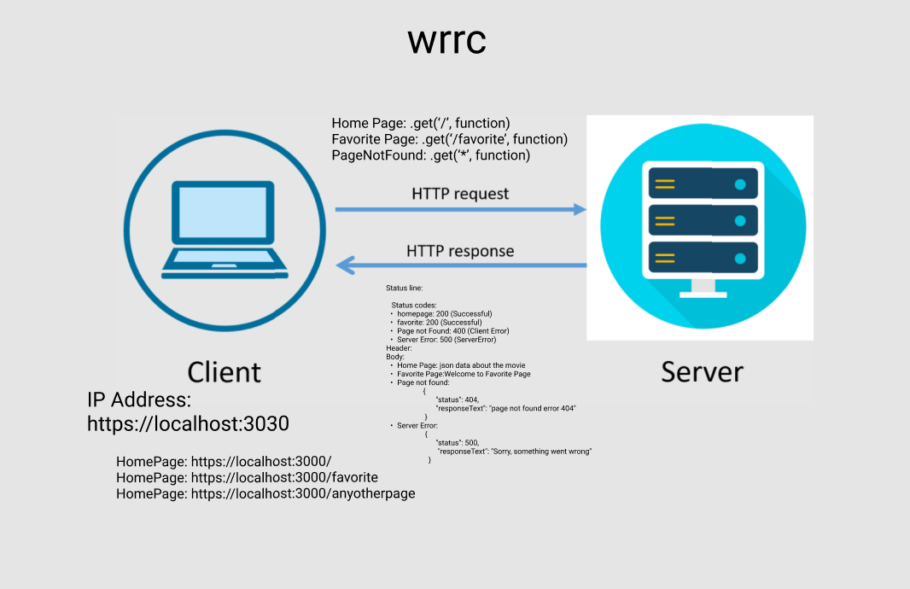

# Movies-Library
Movie app that can check the latest movies based on specific categories.
# Project Name - Project Version

**Author Name**: Raghad Abdulhadi

## WRRC
<!-- Add an image of your WRRC here -->

## Overview

## Getting Started
<!-- What are the steps that a user must take in order to build this app on their own machine and get it running? -->
The use should install the node modules, .gitignore, eslintrc.json, package.json, in the visual code to get access to all the modules and code used to run the app.

## Project Features
<!-- What are the features included in you app -->
- Home Page Endpoit which directs to the homepage by / path 
- Favorite Endpoint which directs to the favorite page by /favorite 
- Page not Found Error Handling 
- Server Error Handling